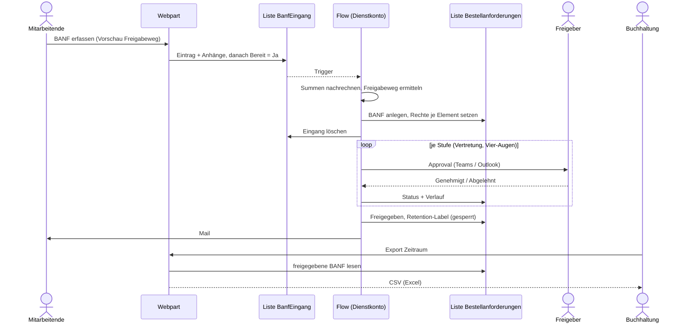

# Finanzportal – Bestellanforderungen (BANF)

Erster Baustein des Finanzportals von VX Instruments: Bestellanforderungen werden in SharePoint bzw. Teams
erfasst, nach Kostenstelle und Betrag freigegeben und von der Buchhaltung exportiert. Reisekosten und Spesen
folgen auf derselben Basis.

| Baustein | Technik | Ort |
|---|---|---|
| Oberfläche | SPFx 1.23 Webpart (React, Fluent UI), läuft in SharePoint und als Teams-Tab | `src/` |
| Fachlogik (Beträge, Freigabeweg, Validierung, CSV) | TypeScript ohne SharePoint-Abhängigkeit, mit Unit-Tests | `src/domain/` |
| Datenhaltung | SharePoint-Listen, angelegt per PnP PowerShell | `provisioning/` |
| Workflow | Power Automate mit Approvals-Connector (Teams/Outlook) | `docs/flow-banf-freigabe.md` |
| Aufbewahrung | Purview-Retention-Label als Datensatz nach Abschluss | `docs/betrieb.md` |

## Ablauf



## Sicherheitsprinzipien

- **Der Client entscheidet nichts.** Das Webpart schreibt nur in die Eingangsliste. Antragsteller, Summen,
  Freigabeweg und Status setzt der Flow; die Vorschau im Formular ist unverbindlich.
- **Vier-Augen-Prinzip** wird bei der Ermittlung des Freigabewegs und nach jeder Antwort geprüft (auch bei
  Neuzuweisung einer Approval-Anfrage).
- **Need-to-know:** Mitarbeitende sehen nur eigene BANF, Freigeber die ihnen vorgelegten, die Buchhaltung alle.
- **Unveränderbarkeit:** Abgeschlossene BANF werden per Retention-Label als Datensatz gesperrt.

## Freigaberegeln

1. Stufe 1: Verantwortlicher der Kostenstelle.
2. Zusätzliche Stufen ab Netto-Betragsgrenzen (Liste `BanfFreigabestufen`), optional nur für bestimmte Kostenstellen.
3. Eingetragene Vertretung genehmigt anstelle des Freigebers.
4. Niemand genehmigt die eigene BANF; entfällt dadurch die höchste Stufe, genehmigt der Rückfall-Freigeber.
5. Eine Person genehmigt dieselbe BANF nur einmal.

Die Regeln sind in `src/domain/freigabeweg.ts` dokumentiert und getestet; der Flow bildet sie nach.

## Entwicklung

Voraussetzung: Node.js 22 (siehe `engines` in `package.json`).

```bash
npm install
npm test          # Build + Unit-Tests (heft test)
npm run build     # Produktions-Build + Paket sharepoint/solution/banf-portal.sppkg
npm start         # Dev-Server für die gehostete Workbench (https://<tenant>.sharepoint.com/_layouts/15/workbench.aspx)
```

Struktur:

```
src/domain/          Fachlogik (rein, testbar)
src/services/        SharePoint-Zugriff (PnPjs), Mapper, Listen-/Feldnamen (schema.ts)
src/webparts/banfPortal/
  components/        React-Oberfläche
provisioning/        Deploy-BanfListen.ps1
docs/                Flow-Anleitung, Einführung und Betrieb
```

Listen- und Feldnamen stehen an drei Stellen und müssen übereinstimmen: `src/services/schema.ts`,
`provisioning/Deploy-BanfListen.ps1` und der Flow.

## Einführung

Siehe [docs/betrieb.md](docs/betrieb.md) (Reihenfolge, Purview-Label, Teams, laufender Betrieb, Grenzen des MVP)
und [docs/flow-banf-freigabe.md](docs/flow-banf-freigabe.md) (Flow Schritt für Schritt mit Testfällen).
